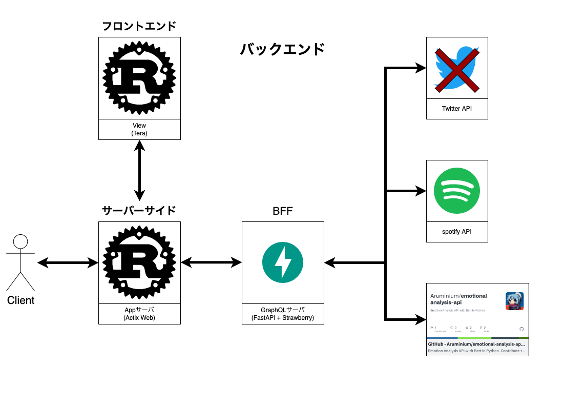

# emosic

emosicは感情と音楽を融合させたアプリケーションです

直接表現しづらいネガティブな気持ち、ちょっと恥ずかしくて伝えられないポジティブな気持ちを音楽に変えて発信しましょう

本アプリケーションは2月11日~12日開催の[【オンライン開発合宿vol.11】「はじめてのハッカソン」](https://talent.supporterz.jp/events/e6d6ab3d-d0b6-4275-8380-12fb07c079b2/?utm_source=next&utm_medium=geekcamp)の成果物です


# features

- 複数のAPIから構成されたマイクロサービスである
- あなたの感情を音楽に変換することができる

## Contibuting

windowsユーザはWSL2を使用してください

makeコマンドも使えるようにしてください

本開発は俗にいうアジャイル開発で進めます。

今回は
1. clientとサーバサイドを繋ぐ
2. サーバーサイドとフロントエンドを繋ぐ
3. サーバーサイドとBFFを繋ぐ
4. APIを使って要件を満たす機能を実装

のそれぞれ満たすコーディングを1サイクルとし、これ2~3日のイテレーションで開発します。
※1,2,3,4は優先度を表しています。

#### 全体ルール

- issueとPRの内容はテンプレートに沿ってください
- コミットの粒度は細かくしてください
- 機能が未完成でも少しでも進んだらPRを!

### Set up

APIの1つとして感情分析APIを使います
API: [emotional-analysis-api](https://github.com/Aruminium/emotional-analysis-api)

```console
$ ./setup.sh
```

1. git clone
2. model install

を行っています

### System architecture

全体の構成としてマイクロサービスアーキテクチャを採用しています。



### frontend design

ここにfigmaのURLや画像を貼ってください

### Git / Github

mainブランチは基本的に弄りません。リリースするときに初めてmergeします

開発するときは developブランチからブランチを切ってください

ブランチの命名規則は
`feature{サイクル番号}/{issue番号}` とします

サイクル番号は [こちら](https://github.com/users/Aruminium/projects/2)のURL末尾`views/hoge`のhogeとします

### frontend

言語: [Rust](https://www.rust-lang.org/ja)

フレームワーク: [Tera](https://ja.reactjs.org/)

CSSフレームワーク: [TailwindCSS](https://tailwindcss.com/)

フロントエンド実装ルール

- viewにビジネスロジックを書かない(凄く簡単に換言すると、viewで計算式とか書かない)
- styleタグは使わない
- TailWindCSSに依存する

### serverside

言語: [Rust](https://www.rust-lang.org/ja)

webフレームワーク: [Actix Web](https://actix.rs/)

サーバーサイド実装ルール

- コーディングは[Rust API ガイドライン(日本語訳)](https://sinkuu.github.io/api-guidelines/checklist.html)に沿ってください

### backend(BFF)
言語: [Python](https://www.python.org/)

webフレームワーク: [FastAPI](https://fastapi.tiangolo.com/)

GraphQL Library: [Strawberry](https://strawberry.rocks/)

[[GraphQL] strawberry and fastapi](https://strawberry.rocks/docs/integrations/fastapi)

今回のBFF(backends for frontends)としての責務はデータ加工です。余分な情報を削ぎ落とします。

以下の例(SNSでありそうなAPI?)を見てみます

```json
{
  "name": "hoge",
  "age": "20",
  "like": {
    "food": "sushi",
    "sports": "soccer"
  }
}
```


これを例えばlike情報が欲しい時BFFでは以下のようにフォーマットしてあげます

```json
{
  "food": "sushi",
  "sports": "soccer"
}
```
